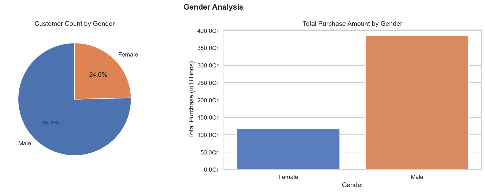
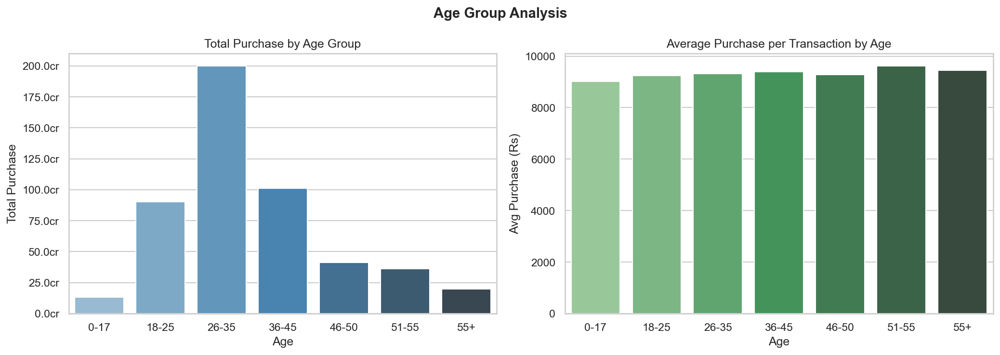
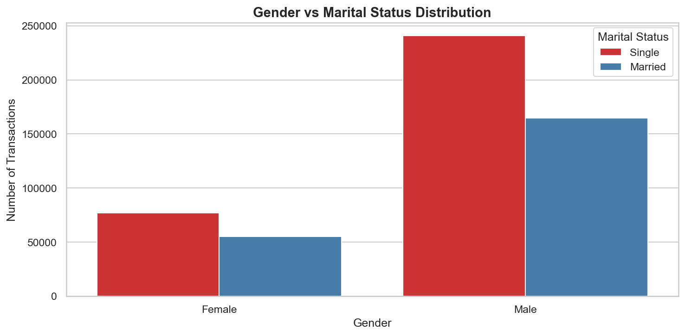
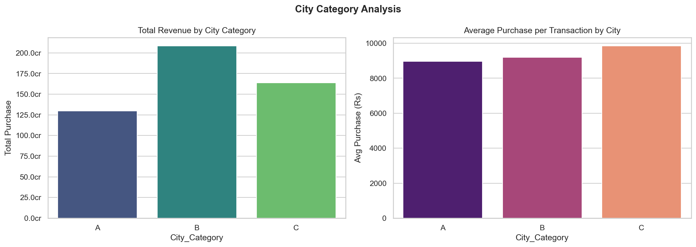
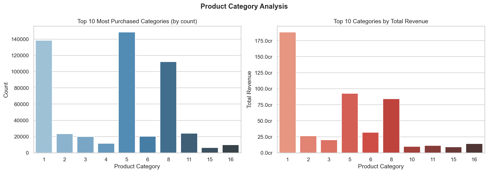
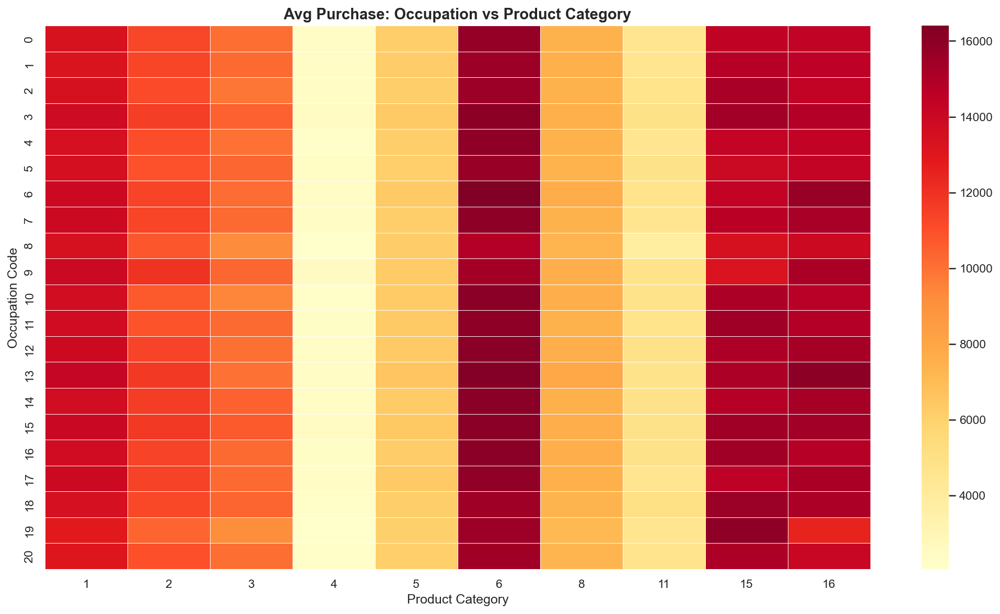
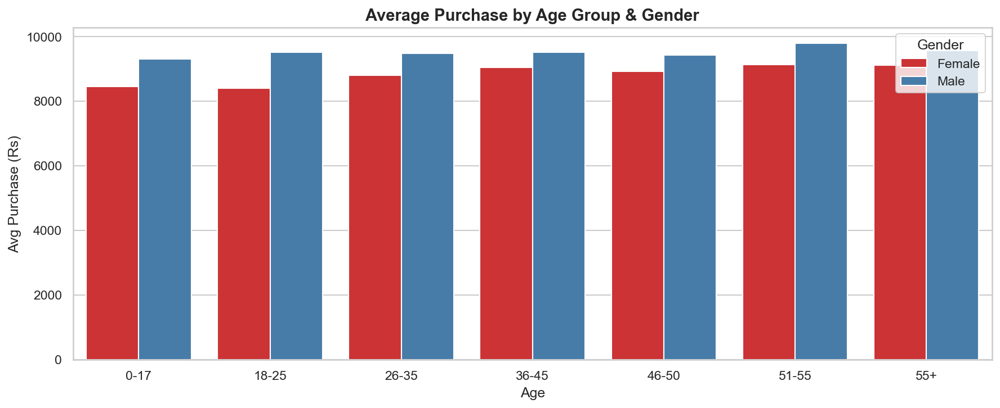

# 🛒 Black Friday Sales Data Analysis

## Problem Statement
Black Friday sales data ke 537,000+ transactions analyze karke yeh samajhna ki **kaun kharidta hai, kya kharidta hai, aur kitna kharchta hai** — taaki retailers apni marketing strategy, inventory planning aur customer targeting better kar sakein.

## Dataset
- **Source:** [Kaggle / GeeksForGeeks](https://github.com/GeeksforgeeksDS/Data-Analysis-with-Python-GFG)
- **Size:** 537,577 rows × 12 columns
- **Columns:** User_ID, Product_ID, Gender, Age, Occupation, City_Category, Stay_In_Current_City_Years, Marital_Status, Product_Category_1, Purchase

## Tools Used
- Python, Pandas, Matplotlib, Seaborn

## Key Business Insights

| # | Insight |
|---|---------|
| 1 | Age group **26-35** contributes **40%+** of total revenue — primary target audience |
| 2 | **Male customers** drive ~75% of total purchases |
| 3 | **City B** generates highest total revenue |
| 4 | **Product Category 1 & 5** are top sellers by both count and revenue |
| 5 | **Single customers** spend slightly more per transaction than married ones |

## Dashboard Previews

### Customer Profile






### City & Location Analysis


### Product Analysis




### Multi-Column Analysis


## How to Run
```bash
pip install pandas matplotlib seaborn jupyter
jupyter notebook BlackFriday_Analysis.ipynb
```

## Project Structure
```
├── BlackFriday_Analysis.ipynb   # Main analysis notebook
├── BlackFriday.csv              # Dataset
├── README.md                    # This file
└── images/                      # All chart screenshots
```
